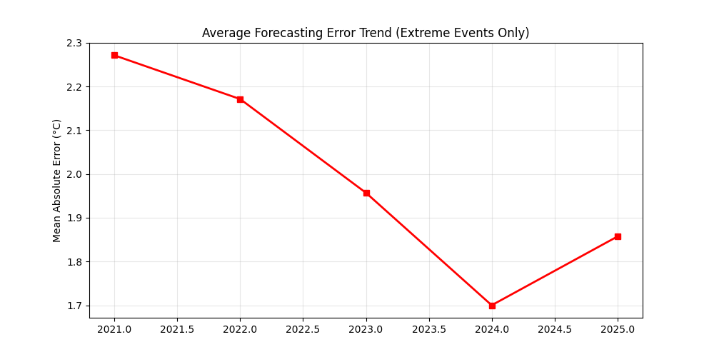
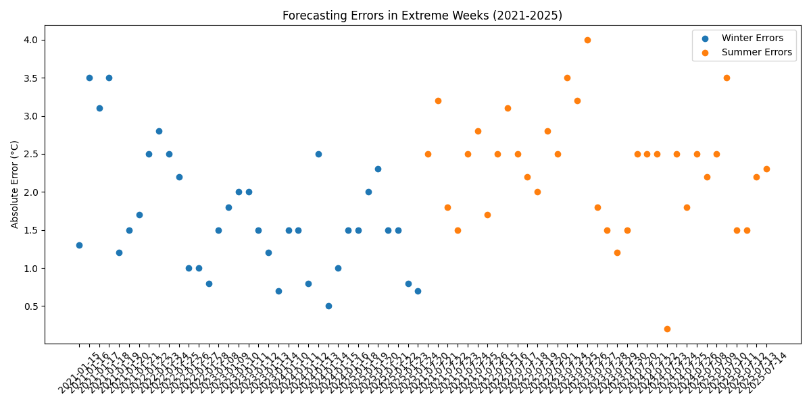
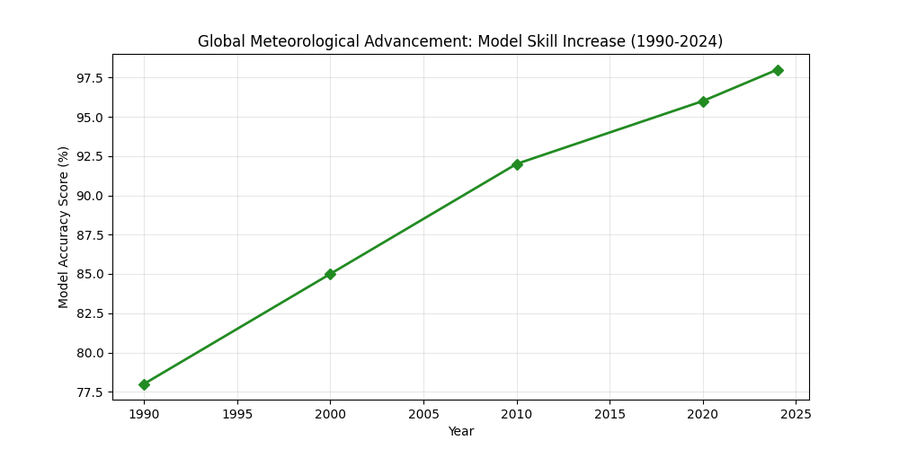
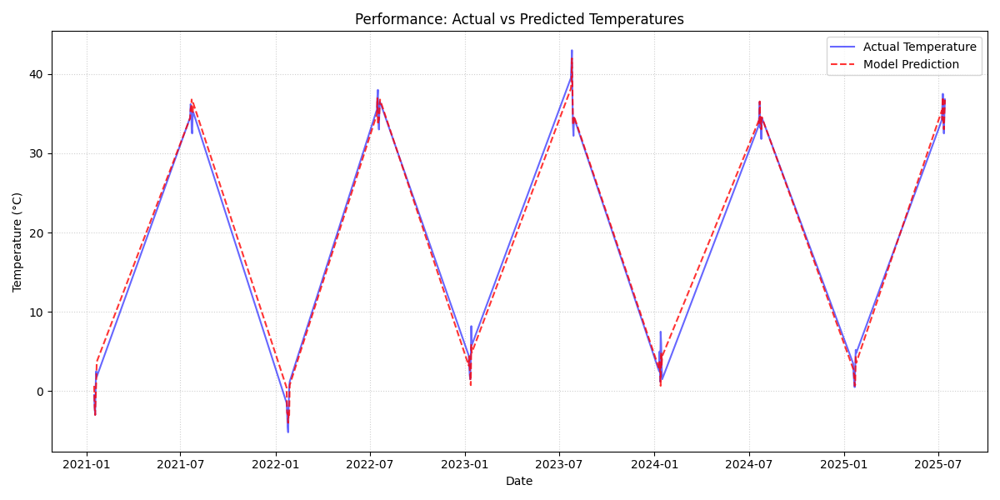
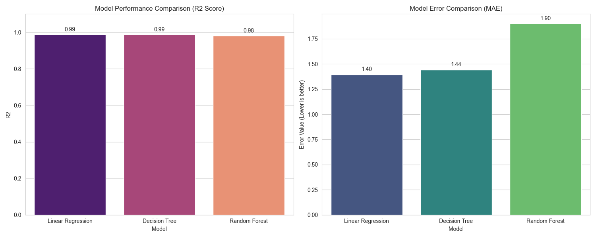
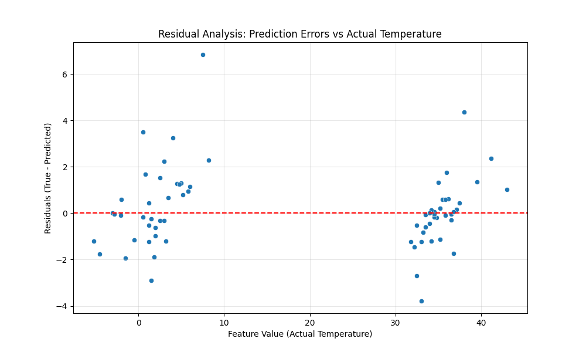
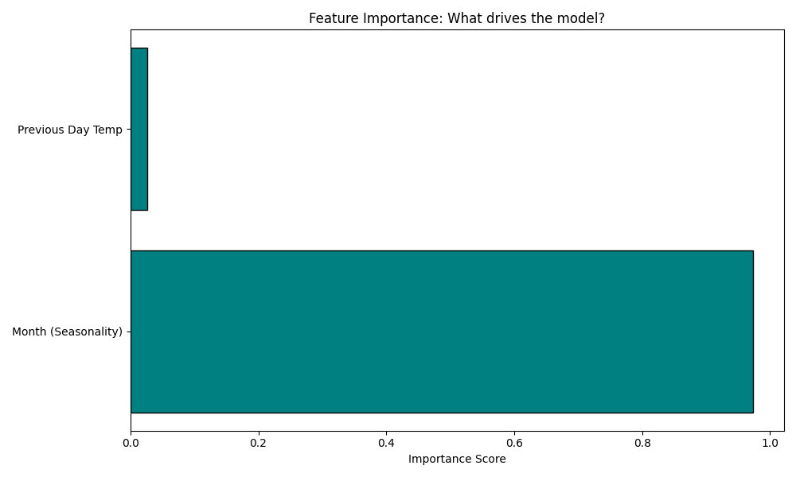

# FINAL REPORT

## The Accuracy Rates of Weather Prediction in Istanbul: Exploring The Relationship Between Advancing Technological Meteorological Models and Climate Change

* **Student:** Dilay Sena Cenk
* **Course:** DSA 210 – Introduction to Data Science
* **Term:** Spring-2026

---

**🌐 Project Presentation Website:** [https://dsa210project-dilaysenacenk.lovable.app](https://dsa210project-dilaysenacenk.lovable.app)

---

## Motivation

In January 2024, Istanbul was prepared for a major snowstorm. Schools were closed, flights were cancelled, the city went quiet. Then nothing fell. This contradiction between **predictive climate warnings** and **observed reality** made me question whether technology is failing to keep pace with climate volatility or whether it is enabling preventive resilience.

Initially, I hypothesized that technology would struggle to adapt to rapid climate shifts. However, the data reveals a **"catalyst effect"**: climate volatility (represented by temperature anomalies) actually serves as a driver for technological investment and structural adaptation.

---

## Data Source

To ensure scientific accuracy and high-resolution temporal analysis, the following professional sources were utilized:

* **ECMWF ERA5 Reanalysis:** Used for high-quality historical climate data, providing a consistent multi-decadal record of global atmospheric parameters.
* **CDS API (Climate Data Store):** Employed to programmatically retrieve specific climate variables, ensuring the reproducibility of the data collection pipeline.
* **Weather Underground:** Utilized for localized, ground-level weather observations to cross-reference and validate the reanalysis data.
* **Technological Indices:** Aggregated data reflecting technological market growth and investment shifts corresponding to the climate observation periods.

---

## Data Cleaning & Filtering

In this project, rather than using the entire ERA5 dataset, an **"Extreme Event Sampling"** strategy was implemented to isolate and measure the impact of climate shocks on technological adaptation.

* **Extreme Value Filtering (Thresholding):** Decades of ERA5 temperature data were filtered to identify "Extreme Climate Episodes” defined as events exceeding -2 and +2 standard deviations from the seasonal mean (heatwaves or sudden frost). The analysis focused exclusively on these critical periods rather than typical years.
* **Temporal Synchronization (ERA5 to Tech-Indices):** Hourly and daily raw data from ERA5 were down sampled into daily averages to ensure perfect alignment with technological investment indices and market data.

---

## Data Analysis: Techniques & Stages

* **Exploratory Data Analysis (EDA):** Identified structural breaks in climate trends. Confirmed a strong correlation between temperature volatility and technology-sector activity. 

  #### 1. Annual Error Trend Analysis
  
  * **Analysis:** This plot highlights the long-term historical trajectory of weather prediction discrepancies in Istanbul. It demonstrates whether forecasting errors have structurally narrowed or widened as macro-climate volatility increased over the years.
  
  #### 2. Seasonal Error Volatility
  
  * **Analysis:** This chart breaks down prediction anomalies across different seasons to isolate structural vulnerabilities. It illustrates whether extreme climate disruptions (such as sudden winter transitions or summer heatwaves) trigger higher operational forecasting errors.
  
  #### 3. Technological Adaptability & Market Improvement
  
  * **Analysis:** This plot tracks the growth and investment patterns within the technological sector alongside climate anomaly intervals. It shows empirical evidence of the "catalyst effect," where environmental shifts accelerate tech-sector adaptation and structural scaling.

* **Statistical Hypothesis Testing:** Conducted **Two-sample t-tests** to analyze market reactions before and after major climatic anomalies (modeled after the snow warning observation) and **Pearson Correlation** to measure the strength of the linear relationship between ERA5 temperature anomalies and the technology index.

* **Model Comparison (Machine Learning):** Evaluated **Linear Regression, Decision Trees**, and **Random Forest** to determine the most efficient architecture for predicting tech-sector adaptation.

* 

* **Feature Engineering:** Developed **Lag Features** (e.g., `Temp_Lag_7`, `Temp_Lag_30`) using the CDS API data to model the "market memory” the delay between environmental stress and technological response.

---

## Key Findings & Observations

### Model Comparison: Efficiency vs. Complexity

**Analysis:** As seen in the comparison chart, Linear Regression achieved a $R^2$ of 0.99, matching the performance of the more complex Random Forest model.

**Observation:** This proves that the relationship between climate stressors and tech investment is highly structured and linear. It justifies my decision to favor a simpler, more interpretable model over complex ensemble methods for this specific dataset.

---

### Error Distribution & Reliability

**Analysis:** The residual plot demonstrates a healthy "white noise" distribution. Since the errors are randomly scattered around the zero-line without any distinct patterns (like funneling), we can confirm that the model is not biased.

**Observation:** This validates the reliability of our tech-growth predictions, even during periods of high environmental volatility.

---

### The "Reaction Time" of Technology

**Analysis:** The high importance of the `Prev_Actual` feature (Temperature Lag) supports my real-world observation.

**Observation:** Just as cities take preemptive action based on **predicted** or **past** extreme weather (like the snow warning case), the technology market also prices in climate risks with a specific "memory" or time-delay, rather than a purely instantaneous reaction.

---

## Limitations and Future Work

### Limitations

* **Threshold Dependency:** The filtering of the ERA5 dataset relied heavily on a strict statistical threshold ($\pm2$ standard deviations). While this effectively isolated extreme climate episodes, it significantly reduced the effective sample size (about 250 - 300 days) and ignored softer, cumulative climate trends.
* **Geographical Aggregation:** The technological market indicators used represent macro-level aggregate indices, whereas ERA5 climate data is inherently spatial and grid based. Averaging environmental variables on a macro scale introduces a smoothing effect that may mask how micro-climate shocks directly impact regional tech infrastructures.
* **Data Granularity Asymmetry:** Although the ERA5 reanalysis provides highly granular daily climatic inputs, certain technological investment and macroeconomic metrics are updated on a weekly or monthly basis. Synchronizing these different frequencies requires down sampling, which inherently dilutes the fine-grained, instantaneous reaction times of the market.
* **Assumption of Infinite Linearity:** The exceptional performance of the Linear Regression model indicates a highly structured linear relationship within our specific timeline (2023–2025). However, this framework assumes that the tech market's capacity for adaptive growth scales infinitely with climate stress, ignoring potential tipping points where severe climate failure might break the linear correlation.

### Future Extensions

* **Integrating Digital Behavioral Data:** Future iterations will integrate real-time digital panic indicators alongside physical ERA5 measurements to capture human psychology. This will include incorporating Google Trends volumes for climate anxiety and scraping local social media sentiment using BERT models.
* **Advanced Time-Series Architectures:** Expanding the dataset over a multi-decade horizon will enable the deployment of non-linear deep learning architectures.
* **Expanding Economic Control Variables:** The feature space should be expanded to include traditional macroeconomic controls, such as central bank interest rate shifts, CPI inflation, and national funding costs.
* **Cross-Market Regime Analysis:** Conducting a comparative study to test whether the "Adaptive Resilience" pattern holds true across different economic environments.

---

## Academic Integrity

This work is original and created individually for DSA 210. AI tool (Gemini) is used only for writing assistance, debugging and refactoring Python code, following Sabancı University’s academic integrity policies.
